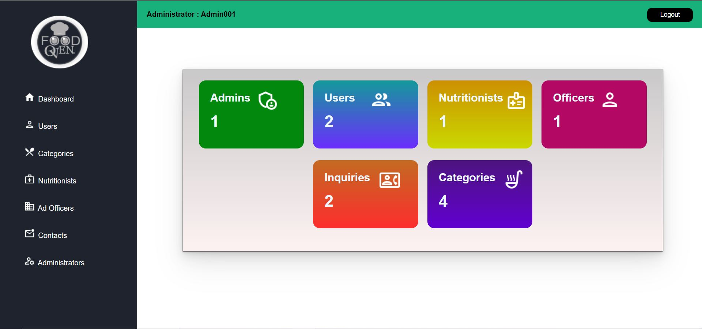

# RMS-Admin-Panel
This is created for Y1S1 IWT Final Project at SLIIT

## Functionalities

- Flexible Dashboard with all system details.
- Only admin role can login admin panel.
- Change Contact information (email, phone,...).
- Manage Members (Edit, Delete, Add and view member information) and change their member role (Regular member, admin).
- Manage Nutritionists Accounts (Edit, Delete, Add and view member information)
- Manage Ad officer Accounts (Edit, Delete, Add and view member information)
- Search User Accounts by their name
- Manage recipe categories (add, edit, delete, view).
- Mange topics (add, edit, delete, view).
- Can view/ delete users subscribed.
- Admin can view/delete inquiries.

## Preview

